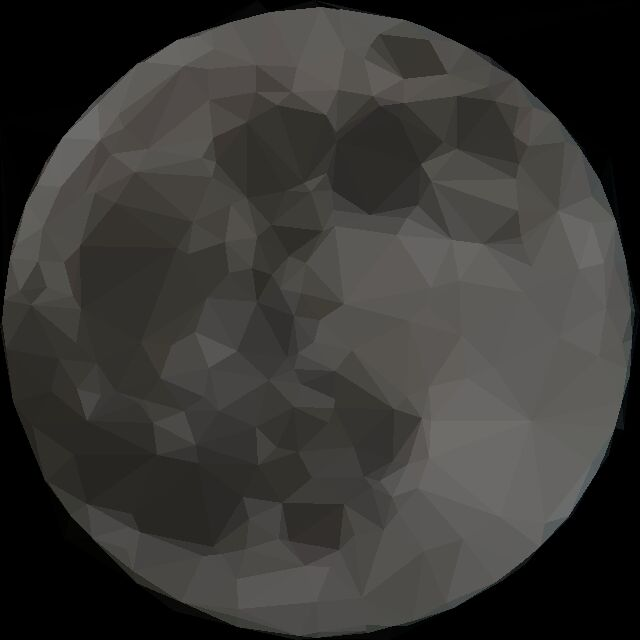
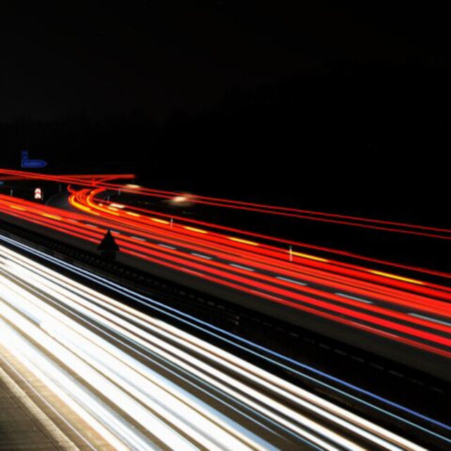
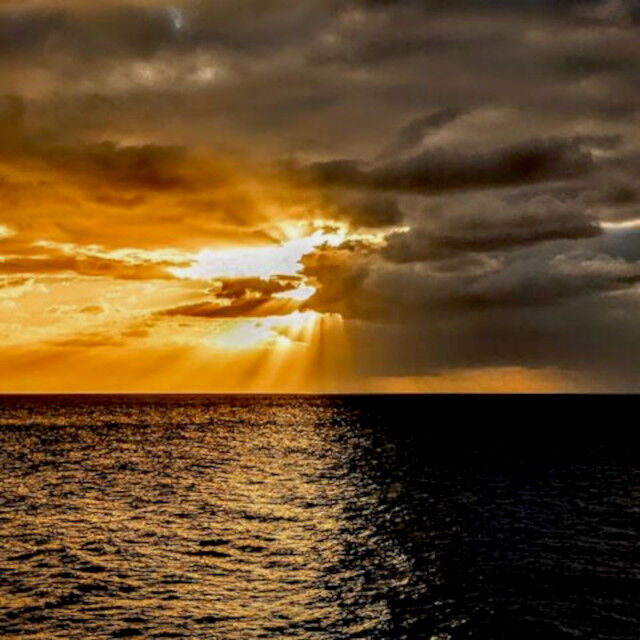

AsteroidOS Wallpapers
=====================

### Adding new wallpapers
- Place jpg, jpeg, png, svg, bmp or webp images of at least 480x480px resolution into the document root.
- Use the `./generate-scaled-images.sh` script to generate preview images.
- Copy all wallpapers and preview images to a watch connected via USB/SDK Mode using the `./copy-to-watch.sh` script.
- For advanced copy options execute `./copy-to-watch.sh -h`.

### Stock wallpapers
Where sorted according to user voting from 2018-04-06.\
All images are placed under the CC BY-NC-SA 2.0, CC BY 2.0, CC BY-SA 3.0 IGO or CC0 1.0 license, you can get them here:

| Image | Creator | Title | Source | License |
|---|---|---|---|---|
| #01  | Adrien Olichon | Untitled | [pexels](https://www.pexels.com/photo/black-and-white-photography-of-sand-2387819/) | CC0 1.0 |
| #02  | Matej | Untitled | [pexels](https://www.pexels.com/de-de/foto/monochrome-fotografie-von-holzbrettern-1024684/) | CC0 1.0 |
| #03  | Adrien Olichon | Untitled | [pexels](https://www.pexels.com/photo/black-sand-dunes-2387793/) | CC0 1.0 |
| #04  | Frankenstein91 | Moon (Triangulated Remix) | original work | CC0 1.0 |
| #05  | Dexter Fernandes | Untitled | [pexels](https://www.pexels.com/photo/rock-formation-close-up-photography-2646237/) | CC0 1.0 |
| #06  | pixabay | Untitled | [pexels](https://www.pexels.com/de-de/foto/blaue-und-weisse-planetenanzeige-87009/) | CC0 1.0 |
| #07  | pickupimage | Untitled | [pickupimage](https://pickupimage.com/free-photos/The-Eclipse-2017-Umbra/2344051) | CC0 1.0 |
| #08  | Jakub Novacek | Untitled | [pexels](https://www.pexels.com/photo/time-lapse-photo-of-stars-on-night-924824/) | CC0 1.0 |
| #09  | Min An | Untitled | [pexels](https://www.pexels.com/de/foto/astrologie-astronomie-dunkel-erkundung-813269/) | CC0 1.0 |
| #10  | Jean Beaufort | Untitled | [publicdomainpictures.net](https://www.publicdomainpictures.net/de/view-image.php?image=309448&picture=milchstrasse) | CC0 1.0 |
| #11  | Egil Sjøholt | Untitled | [pexels](https://www.pexels.com/de-de/foto/schattenbildfotografie-der-person-unter-sternenhimmel-1906658/) | CC0 1.0 |
| #12  | pixabay | Untitled | [pexels](https://www.pexels.com/de-de/foto/lila-nebel-262750/) | CC0 1.0 |
| #13  | Petr Kratochvil | Halloween Gradient Background | [publicdomainpictures.net](https://www.publicdomainpictures.net/en/view-image.php?image=369181&picture=halloween-gradient-background) | CC0 1.0 |
| #14  | Andrea Stöckel | Untitled | [publicdomainpictures.net](https://www.publicdomainpictures.net/de/view-image.php?image=428245&picture=galaxis-nebula-sterne-weltraum) | CC0 1.0 |
| #15  | Felix Mittermeier | Untitled | [pexels](https://www.pexels.com/de-de/foto/foto-der-konstellation-2832084/) | CC0 1.0 |
| #16  | cmonphotography | Silhouette Of Mountains During Dawn | [pexels](https://www.pexels.com/photo/silhouette-of-mountains-during-dawn-1809644/) | CC0 1.0
| #17  | Brett Jordan | Cross-processed Sky | [flickr](https://flic.kr/p/dSS4H6) | CC BY 2.0 |
| #18  | Pixabay | High Rise Buildings during Night Time Photo | [pexels](https://www.pexels.com/photo/high-rise-buildings-during-night-time-photo-219692/) | CC0 1.0 |
| #19  | Frankenstein91 | Autobahn | original work | CC0 1.0 |
| #20  | Dawn Hudson | Rainbow Ribbons | [publicdomainpictures.net](https://www.publicdomainpictures.net/en/view-image.php?image=80634&picture=rainbow-ribbons) | CC0 1.0 |
| #21  | NASA, ESA, STScI | Lagoon Nebula | [NASA](https://hubblesite.org/contents/media/images/2018/21/4150-Image.html) | [public domain](https://www.nasa.gov/multimedia/guidelines/index.html) |
| #22  | Andrea Stöckel | Untitled | [publicdomainpictures.net](https://www.publicdomainpictures.net/de/view-image.php?image=435438&picture=abstrakt-fraktal-kunst-kosmos) | CC0 1.0 |
| #23  | NASA | Heart and Soul nebulae | [Wikipedia](https://commons.wikimedia.org/wiki/File:Heart_and_Soul_nebulae.jpg) |  [public domain](https://www.nasa.gov/multimedia/guidelines/index.html) |
| #24  | Dawn Hudson | Green Ribbon Background | [publicdomainpictures.net](https://www.publicdomainpictures.net/en/view-image.php?image=74921&picture=green-ribbon-background) | CC0 1.0 |
| #25  | Tobias Bjørkli | Photo of Aurora During Evening | [pexels](https://www.pexels.com/photo/photo-of-aurora-during-evening-1938348/) | CC0 1.0 |
| #26  | Eberhard Grossgasteiger | Mountain during Golden Hour | [pexels](https://www.pexels.com/photo/mountain-during-golden-hour-2347011/) | CC0 1.0 |
| #27  | Brett Jordan | Pinky Sunset | [flickr](https://flic.kr/p/favbza) | CC BY 2.0 |
| #28  | Travis Seera | baume beleuchtung dammerung dunkel | [pexels](https://www.pexels.com/de/foto/baume-beleuchtung-dammerung-dunkel-173921/) | CC0 1.0 |
| #29  | George Becker | abend-architektur-dammerung-draussen | [pexels](https://www.pexels.com/de/foto/abend-architektur-dammerung-draussen-351432/) | CC0 1.0 |
| #30  | asmuSe | Tianjin Twilight City Landschaft Tourismus | [pixabay](https://pixabay.com/photo-2185510/) |  CC0 1.0 |
| #31  | Frankenstein91 | Come2DarkSide | original work | CC0 1.0 |
| #32  | CC0 1.0 |
| #33  | Andrea Stöckel | Sternenhimmel | [publicdomainpictures.net](https://www.publicdomainpictures.net/de/view-image.php?image=438375&picture=sternenhimmel-sterne-himmel-foto) | CC0 1.0 |
| #34  | Cindy Lever Cleverpix | Untitled | [pixabay](https://pixabay.com/photo-1373171/) |  CC0 1.0 |
| #35  | David Mark | Sea | [pixabay](https://pixabay.com/photo-1883657/) |  CC0 1.0 |
| #36  | Carloyuen | Wolken Nebel Der Familienname Berg Hong Kong | [pixabay](https://pixabay.com/photo-2517653/) |  CC0 1.0 |
| #37  | G4889166 | Regen Straße Stadt Hintergrund | [pixabay](https://pixabay.com/photo-2466803/) |  CC0 1.0 |
| #38  | Sebastian Voortman | abenteuer action aktion aufsicht | [pexels](https://www.pexels.com/de/foto/abenteuer-action-aktion-aufsicht-312105/) |  CC0 1.0 |
| #39  | George Hodan | Grunge Background | [pexels](https://www.publicdomainpictures.net/en/view-image.php?image=169006&picture=grunge-background) | CC0 1.0 |
| #40  | bm.iphone | texture | [flickr](https://flic.kr/p/afH116) | CC BY 2.0 |
| #41  | Ryan McGinty | Westfjords Region Iceland (Triangulated Remix) | [pexels](https://www.pexels.com/de/foto/abend-abstrakt-berg-dammerung-361726/) | CC0 1.0 |
