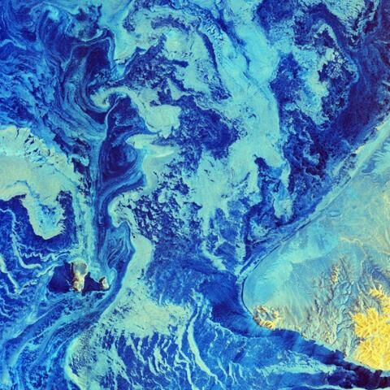
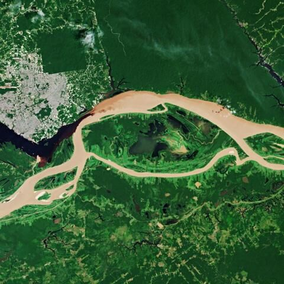
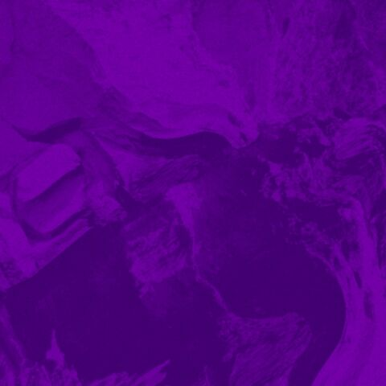

AsteroidOS Wallpapers
=====================

Sorted according to user voting from 2018-04-06.\
All images are placed under the CC BY-NC-SA 2.0, CC BY 2.0, CC BY-SA 3.0 IGO or CC0 1.0 license, you can get them here:

| Image | Creator | Title | Source | License |
|---|---|---|---|---|
| #01  | Joe deSousa | Greek Sunrise on the Ionian Sea | [flickr](https://flic.kr/p/JQm1of) | CC0 1.0 |
| #02  | Brett Jordan | Pinky Sunset | [flickr](https://flic.kr/p/favbza) | CC BY 2.0 |
| #03  | G4889166 | Regen Straße Stadt Hintergrund | [pixabay](https://pixabay.com/photo-2466803/) |  CC0 1.0 |
| #04  | 12019 | Frankreich Berge Nebel Sonnenaufgang Wald Bäume | [pixabay](https://pixabay.com/photo-1790999/) |  CC0 1.0 |
| #05  | rawpixel.com | bokeh photography effect | [pexels](https://www.pexels.com/photo/bokeh-photography-effect-891683/) |  CC0 1.0 |
| #06  | Brett Jordan | Cross-processed Sky | [flickr](https://flic.kr/p/dSS4H6) | CC BY 2.0 |
| #07  | Glenn Morello | berge farben gestalten hell | [pexels](https://www.pexels.com/de/foto/berge-farben-gestalten-hell-731659/) | CC0 1.0 |
| #08  | Sebastian Voortman | beach dawn dusk ocean | [pexels](https://www.pexels.com/photo/beach-dawn-dusk-ocean-189349/) | CC0 1.0 |
| #09  | Jan Beck | Schauinsland im Winter | [flickr](https://flic.kr/p/cWLkjN) | CC BY 2.0 |
| #10  | Min An | astrologie astronomie dunkel erkundung | [pexels](https://www.pexels.com/de/foto/astrologie-astronomie-dunkel-erkundung-813269/) | CC0 1.0 |
| #11  | Brett Jordan | Saturated Sands | [flickr](https://flic.kr/p/czdQr9) | CC BY 2.0 |
| #12  | asmuSe | Tianjin Twilight City Landschaft Tourismus | [pixabay](https://pixabay.com/photo-2185510/) |  CC0 1.0 |
| #13  | Reinhard Link | New York: Empire State Building & skyscrapers in sunset light | [flickr](https://flic.kr/p/PLzLnX) | CC BY-NC-SA 2.0 |
| #14  | Thomas Leuthard | Lisboa #24 | [flickr](https://www.flickr.com/photos/thomasleuthard/9240057900/) | CC BY 2.0 |
| #15  | mikefoster | String Bass Gitarre Musik Stein Ton Instrument | [pixabay](https://pixabay.com/de/string-bass-gitarre-musik-stein-555070/) |  CC0 1.0 |
| #16  | Sebastian Voortman | abenteuer action aktion aufsicht | [pexels](https://www.pexels.com/de/foto/abenteuer-action-aktion-aufsicht-312105/) |  CC0 1.0 |
| #17  | Engin_Akyurt | Holz-Faserplatten Baum Boden Muster Holz Braun | [pixabay](https://pixabay.com/de/holz-faserplatten-baum-boden-muster-3219590/) |  CC0 1.0 |
| #18  | bm.iphone | texture | [flickr](https://flic.kr/p/afH116) | CC BY 2.0 |
| #19  | Ryan McGinty | abend abstrakt berg dammerung | [pexels](https://www.pexels.com/de/foto/abend-abstrakt-berg-dammerung-361726/) | CC0 1.0 |
| #20  | Engin_Akyurt | Holz Baum Textur Abstrakt Motiv Detailaufnahmen | [pixabay](https://pixabay.com/de/holz-baum-textur-abstrakt-motiv-3052032/) |  CC0 1.0 |
| #21  | bm.iphone | texture | [flickr](https://flic.kr/p/afKDZw) | CC BY 2.0 |
| #22  | 4510waza | Tea leaf　八十八夜 | [flickr](https://www.flickr.com/photos/4510waza/2455787369/) | CC BY 2.0 |
| #23  | 12019 | meer ozean wasser reflexionen | [pixabay](https://pixabay.com/photo-1883657/) |  CC0 1.0 |
| #24  | Travis Seera | baume beleuchtung dammerung dunkel | [pexels](https://www.pexels.com/de/foto/baume-beleuchtung-dammerung-dunkel-173921/) | CC0 1.0 |
| #25  | composita | Mädchen Schaukelt Skyline Wolkenkratzer Downtown | [pixabay](https://pixabay.com/photo-2067378/) |  CC0 1.0 |
| #26  | Elné | Texture Green No. 53 | [flickr](https://www.flickr.com/photos/neighya/9440091829/) | CC BY 2.0 |
| #27  | Markus Spiske | the alps top view near adriatic sea | [flickr](https://flic.kr/p/D7bVLn) | CC0 1.0 |
| #28  | Pexels | Verschwommen Bokeh Bunte Beleuchtung | [pexels](https://pixabay.com/photo-1834820/) | CC0 1.0 |
| #29  | Thomas Leuthard | Jökulsárlón, Iceland | [flickr](https://www.flickr.com/photos/thomasleuthard/18155790692/) |  |  | I think it's a good lighttrail | CC BY 2.0 |
| #30  | simon.hedge | Ipswich is THAT way | [flickr](https://www.flickr.com/photos/shedge/5447882622/) | CC BY 2.0 |
| #31  | weisanjiang | City Skyline Stadtansicht Gebäude Sonnenuntergang | [pexels](https://pixabay.com/photo-3024616/) | CC0 1.0 |
| #32  | Lucas Insight | blase-farben-gestalten-h2o | [pexels](https://www.pexels.com/de/foto/blase-farben-gestalten-h2o-824678/) | CC0 1.0 |
| #33  | Kevin Dooley | Lake Michigan serenity | [flickr](https://www.flickr.com/photos/pagedooley/3869914397/) | CC BY 2.0 |
| #34  | skeeze | Landschaft Nebel Afrika Heißluftballon Blick | [pixabay](https://pixabay.com/photo-606843/) |  CC0 1.0 |
| #35  | Free-Photos | Ozean Oberfläche Sonnenuntergang Wellen Meer | [pixabay](https://pixabay.com/photo-918998/) |  CC0 1.0 |
| #36  | Aphiwat chuangchoem | bananenblatt baum blatt draussen | [pexels](https://www.pexels.com/de/foto/bananenblatt-baum-blatt-draussen-365638/) | CC0 1.0 |
| #37  | Cleverpix | sonnenuntergang baum wasser | [pixabay](https://pixabay.com/photo-1373171/) |  CC0 1.0 |
| #38  | George Becker | abend-architektur-dammerung-draussen | [pexels](https://www.pexels.com/de/foto/abend-architektur-dammerung-draussen-351432/) | CC0 1.0 |
| #39  | carloyuen | Wolken Nebel Der Familienname Berg Hong Kong | [pixabay](https://pixabay.com/photo-2517653/) |  CC0 1.0 |
| #40  | Kevin Dooley | Milion dollar sunsets 2013 | [flickr](https://www.flickr.com/photos/pagedooley/9736485307/) | CC BY 2.0 |
| #41  | Contains modified Copernicus Sentinel data (2015–16) / ESA SEOM INSARAP study / PPO.labs / Norut / NGU | Bay Area Displacement | [ESA](http://www.esa.int/Applications/Observing_the_Earth/Copernicus/Sentinel-1/Satellites_confirm_sinking_of_San_Francisco_tower) | CC BY-SA 3.0 IGO |
| #42  | contains modified Copernicus Sentinel data (2019), processed by ESA | Bering in dire straits | [ESA](https://www.esa.int/ESA_Multimedia/Images/2019/03/Bering_in_dire_straits) | CC BY-SA 3.0 IGO |
| #43  | Copernicus Sentinel data (2018), processed by ESA | Meeting of waters | [ESA](https://www.esa.int/ESA_Multimedia/Images/2019/09/Meeting_of_waters) | CC BY-SA 3.0 IGO |
| #44  | JRT | Fluid Lilac |[jrtberlin.de](https://dl.jrtberlin.de/wallpapers/fluid_lilac/) | CC BY-SA 3.0 IGO |